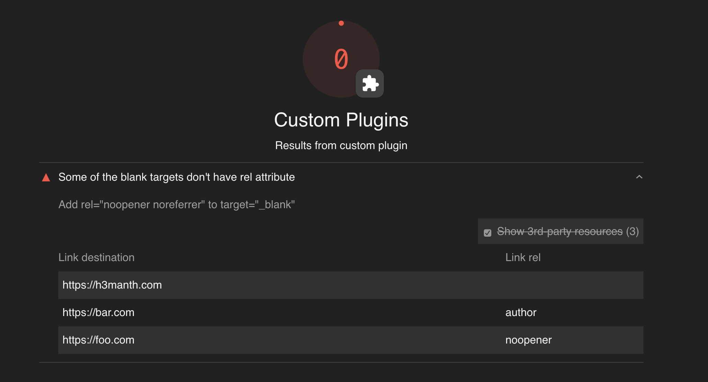

# lighthouse blank-taget plugin
> Checks blank tagets for rels.

## Running it locallly:

```sh
NODE_PATH=.. yarn lighthouse https://example.com --plugins=lighthouse-plugin-blank-target --only-categories=lighthouse-plugin-blank-target --gather-mode
NODE_PATH=.. yarn lighthouse https://example.com --plugins=lighthouse-plugin-blank-target --only-categories=lighthouse-plugin-blank-target --audit-mode --view
```

## To run as a plugin user

1. Install `lighthouse` (v5+) and the plugin `lighthouse-plugin-blank-target`, likely as `devDependencies`. 
   * `npm install -D lighthouse lighthouse-plugin-blank-target`
1. To run your private lighthouse binary, you have three options
   1. `npx --no-install lighthouse https://example.com --plugins=lighthouse-plugin-blank-target --view`
   1. `yarn lighthouse https://example.com --plugins=lighthouse-plugin-blank-target --view`
   1. Add an npm script calling `lighthouse` and run that.

## Result




P.S: I realised it later that the default LH audit already covers this use case, so didn't publish this plugin, but the code can still be used to understand the plugin creation.
